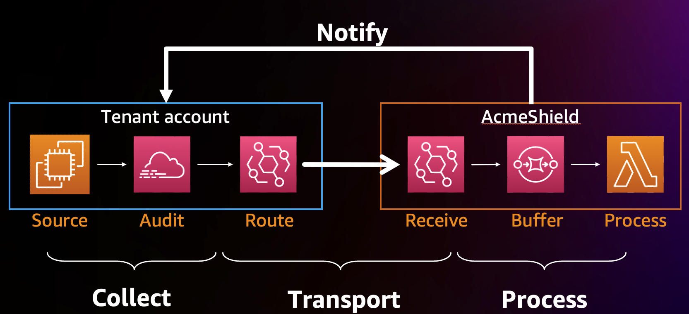

# Building event-driven multi-account activity monitoring solutions

In this webinar, we'll discuss how to effectively implement real-time, multi-account activity monitoring. You'll learn how organizations are moving beyond traditional polling methods to adopt modern event-driven architectures that can effectively monitor thousands of AWS accounts. Experts from AWS and CrowdStrike will share the latest strategies and provide real-world insights from their experience implementing these solutions at scale.

In this session, you’ll learn:

* Traditional polling-based approach limits
* Evolving to push-based systems with event-driven architectures
* Using CloudTrail and EventBridge for real-time activity monitoring and automated response
* Designing cost-effective and efficient cross-account data transport mechanisms
* Building resilient data pipelines that can handle enterprise-scale events volume
* Best practices for filtering, classification, and priority-based processing

Join us to learn about modern methodologies of multi-account activity monitoring from industry leaders. Whether you're an AppSec team leader, cloud security professional, or solution architect, you'll gain practical knowledge for enhancing your organization's cloud security posture.

[VIDEO TBD]

### Resources

* [Enhancing multi-account activity monitoring with event-driven architectures](https://aws.amazon.com/blogs/compute/enhancing-multi-account-activity-monitoring-with-event-driven-architectures/)
* [Detect Adversary Behavior in Milliseconds with CrowdStrike and Amazon EventBridge](https://aws.amazon.com/blogs/architecture/detect-adversary-behavior-in-seconds-with-crowdstrike-and-amazon-eventbridge)
* [CloudTrail events in EventBridge](https://docs.aws.amazon.com/eventbridge/latest/userguide/eb-service-event-cloudtrail.html)
* [EventBridge input transformers](https://docs.aws.amazon.com/eventbridge/latest/userguide/eb-transform-target-input.html)
* [Event structure reference](https://docs.aws.amazon.com/eventbridge/latest/ref/welcome.html)
* [The list of AWS services that send events to EventBridge](https://docs.aws.amazon.com/eventbridge/latest/ref/events.html)
* [EventBridge partner integrations](https://docs.aws.amazon.com/eventbridge/latest/userguide/eb-saas.html)

